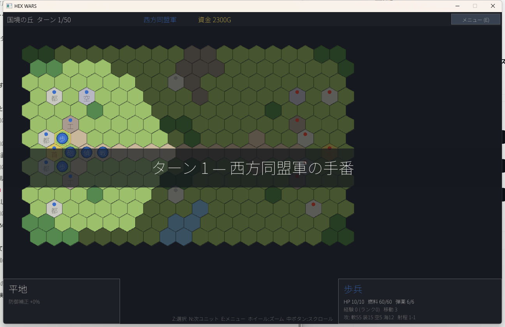

# HEX WARS（仮題）

`hex_wars_spec.md` に基づく、大戦略ライクなターン制ウォー・シミュレーションゲーム。
C11 + SDL2 + SDL2_ttf 製。ロジック層（`src/core/`）はSDL非依存で単体テスト可能。



## 実装状況（仕様書の開発フェーズ対応）

| フェーズ | 状態 |
|---|---|
| Phase 1: コア基盤（ヘクス座標・マップ表示・移動範囲・dataパーサ） | ✅ |
| Phase 2: 戦闘成立（戦闘・ZOC・占領・生産・資金・ターン制御・勝利判定・ホットシート対人） | ✅ |
| Phase 3: CPU（脅威マップ・役割別評価・生産AI・難易度3段階） | ✅ |
| Phase 4: キャンペーン（.cpn・ブリーフィング・持越し・分岐）/ セーブ・ロード | ✅ |
| Phase 5: 仕上げ（索敵・経験値・修理・輸送・サウンド・戦闘アニメ・オプション） | ✅ |

実装済みルール: IGO-UGO ターン制 / 収入・補給・修理 / Dijkstra移動範囲 + ZOC（FOOTの1歩抜け対応）/
攻撃→反撃（間接攻撃は反撃不可・移動後攻撃不可 FAM式）/ 弾薬・燃料（空中は墜落、海上は漂流）/
経験値ランク / 建物占領（耐久20削り）/ 生産（工場・空港・港）/ 索敵（森・都市の隠蔽、潜水艦、
アンブッシュ停止、CPUチートなし）/ 勝利条件（首都陥落・全滅・ターン切れ・防衛成功）/
輸送（トラック・輸送ヘリ・輸送艦。搭載/降車、輸送撃破で搭載喪失。CPUも運用: 陸路で
届かない敵拠点には輸送艦/輸送ヘリで上陸作戦を行い、トラックで足の遅い部隊を前線まで
速く運ぶ）/
補給車・補給機（補給物資を積載。「補給」で隣接味方の燃料・弾薬を回復＝物資-1/体、
「回復」で物資10ごとに1HP回復。**補給車は陸部隊のみ・補給機は空部隊のみ**が対象。
物資は都市/工場/首都（補給機は空港）でターン開始時に補充。AIも運用）/
艦船（駆逐艦・巡洋艦・潜水艦・輸送艦・戦艦・空母・砲艦・ミサイル艇。港で生産。
空母は艦載機を2機搭載でき、搭載中の航空機はターン開始時に空港と同様に燃料・弾薬回復＋HP修理される）/
勝利条件4種（首都陥落・全滅・ターン切れ/防衛・**拠点n個確保** `objective_count`）/
セーブ・ロード（スロット10 + 手番開始時オートセーブ。CRC32付き独自バイナリ v2）/
キャンペーン「西方の反攻」全10作戦（早期勝利分岐×2、生存ユニット・資金の持越し、敗北時は再挑戦可、
**作戦全体図**で進行を可視化、ブリーフィング1枚絵）/
サウンド（BGM5曲・SE10種、SDL2_mixer。音量0-10をオプションで永続化）/
戦闘アニメ（HPバー減少+SE、Zでスキップ、オプションでOFF可）/
UI文字列の `data/text_ja.def` 外部化

ビルド規約（仕様書 2.2 / 13章）: Debug構成は警告をエラー扱い（/WX・-Werror）、
core/data 層の SDL include は CMake configure 時に検出してエラーにする。

マップ表示は**斜め見下ろし（2.5D）**が既定。真上からの平面図をY方向に圧縮し、
`terrain.def` の `height` に応じてタイルを持ち上げて側面（崖）を描くことで立体的に見せる。
**見た目だけの変換で移動・戦闘のルールには一切影響しない**（オプションで「平面（真上）」に戻せる）。

残る簡略化（仕様との差分）:
- 地形はSDLの図形描画によるフラットベクタ風（データ駆動の地形色・起伏）。
  ユニットはPNGスプライト対応（下記）。画像未指定のユニットは図形+兵科文字で描画
- BGM/SE・ブリーフィング絵は手続き生成（`tools/gen_audio.py` / `gen_brief_art.py` で再生成可能）
- 戦闘アニメはプレイヤー側の攻撃のみ（CPUの攻撃は即時結果。カットインも同様）
- カットインの1枚絵は手続き生成の仮絵（`tools/gen_cutin_art.py` で再生成可能。差し替え前提）
- 戦闘BGM「陣営毎」はマップ毎の2曲切替で代替

## ビルド（Windows / MSVC）

必要: Visual Studio 2022以降（C++ワークロード）+ CMake + Ninja。

### 先に SDL2 を用意する

**リポジトリには SDL2 一式を含めていません**（合計90MB超のため）。
以下の4つの「VC用開発ライブラリ（`-devel-*-VC.zip`）」をダウンロードし、
展開したフォルダを `third_party/` の直下に置いてください。

| ライブラリ | 使用中のバージョン | 配布元 |
|---|---|---|
| SDL2 | 2.32.10 | https://github.com/libsdl-org/SDL/releases |
| SDL2_ttf | 2.24.0 | https://github.com/libsdl-org/SDL_ttf/releases |
| SDL2_image | 2.8.12 | https://github.com/libsdl-org/SDL_image/releases |
| SDL2_mixer | 2.8.1 | https://github.com/libsdl-org/SDL_mixer/releases |

配置後はこうなります（フォルダ名はzipの中身のまま）。

```
third_party/
  SDL2-2.32.10/
  SDL2_ttf-2.24.0/
  SDL2_image-2.8.12/
  SDL2_mixer-2.8.1/
```

PowerShell で一括取得する例:

```powershell
$tp = "third_party"; New-Item -ItemType Directory -Force $tp | Out-Null
$urls = @(
  "https://github.com/libsdl-org/SDL/releases/download/release-2.32.10/SDL2-devel-2.32.10-VC.zip",
  "https://github.com/libsdl-org/SDL_ttf/releases/download/release-2.24.0/SDL2_ttf-devel-2.24.0-VC.zip",
  "https://github.com/libsdl-org/SDL_image/releases/download/release-2.8.12/SDL2_image-devel-2.8.12-VC.zip",
  "https://github.com/libsdl-org/SDL_mixer/releases/download/release-2.8.1/SDL2_mixer-devel-2.8.1-VC.zip"
)
foreach ($u in $urls) {
  $z = Join-Path $tp (Split-Path $u -Leaf)
  Invoke-WebRequest $u -OutFile $z
  Expand-Archive $z $tp -Force
  Remove-Item $z
}
```

### ビルド

```bat
:: "x64 Native Tools Command Prompt" から
cmake -S . -B build -G Ninja -DCMAKE_BUILD_TYPE=Release
cmake --build build
build\hexwars.exe
```

Linuxでは `find_package(SDL2)` 経由でビルドします（SDL2/SDL2_ttf の開発パッケージが必要）。

### テスト

```bat
cmake --build build
ctest --test-dir build          :: core単体テスト + AI自動対戦シミュレーション
```

## 操作方法

| 操作 | マウス | キー |
|---|---|---|
| カーソル移動 | ポインタ | 矢印 |
| 決定 / 選択 | 左クリック | Z / Enter |
| キャンセル | 右クリック | X / Esc |
| 次の未行動ユニット | — | N |
| ターン終了 | 右上「メニュー」 | E |
| ズーム | ホイール | — |
| スクロール | 中ボタンドラッグ | — |

遊び方: 自ユニットをクリック → 移動先をクリック → 「攻撃 / 占領 / 降ろす / 待機」を選択。
自軍の工場・空港・港（ユニット不在）をクリックすると生産メニューが開きます。
歩兵をトラック等の輸送ユニットの上へ移動させると搭載。
セーブは E メニュー →「セーブ」。手番開始時にスロット0へ自動セーブされます。
敵首都の占領、または敵全滅で勝利。

## データ駆動

- `data/units.def` … ユニット29種＝陸14/空7/海8（うち補給ユニット2種。攻撃力はダメージ×10スケール。
  `supply = 1` を付けると隣接味方へ補給・回復できる（自分と同じ陸/空/海ドメインのみ対象）。ammo 値が補給物資の量）
- `data/terrain.def` … 地形12種（移動コストは2倍整数、色もここで定義。
  `height` は斜め見下ろし表示での起伏＝**見た目専用**で、山22/丘11/海-7 など。ルールには無影響）
- `data/maps/*.map` … マップ12枚（1文字=1ヘクスの地形レイヤ + 所有者 + 初期配置）
- `data/maps/maplist.txt` … フリー対戦のマップ一覧（6枚）
- `data/campaign/main.cpn` … キャンペーン定義（10ノード・分岐・ブリーフィング文。
  各ノードの `art =`＝出撃前の1枚絵、`reward =`＝クリア時のご褒美画像）
- `data/text_ja.def` … UI文字列（多言語化の下地）

攻撃時のカットインは `units.def` の `cutin =`（ユニット別）を優先し、無ければ
`commanders.def` の `cutin =`（指揮官別）にフォールバックする。どちらも未指定なら出ない。
表示頻度はオプションの「攻撃時のカットイン」で **毎回出す / 撃破したときだけ / 出さない** から選べる。

いずれもテキスト編集だけでバランス調整・マップ追加が可能です。

### ユニット画像の差し替え

units.def の各ユニットに `image =` で任意のPNG（`assets/` からの相対パス）を指定できます。
透過PNG推奨・サイズ任意（ヘクスに合わせて自動スケール）。陣営ごとに変えたい場合は
`image0`（西方同盟）/ `image1`（東方連邦）で個別指定できます。

```
[unit TANK]
image  = gfx/units/tank.png      # 両陣営共通
#image0 = gfx/units/tank_blue.png   # 陣営別にする場合
#image1 = gfx/units/tank_red.png
```

`image` を書かなければ従来どおり図形+兵科文字（歩・戦…）で描画されます。
同梱のサンプルスプライト16種は `tools/gen_units_gfx.py`（要Pillow）で生成したものなので、
好きな画像に上書きするか、units.def のパスを変更してください。
陣営の判別はスプライト脇の色チップ（青の丸=西方 / 赤の菱形=東方）で行います。

## ディレクトリ

```
src/core/   SDL非依存の純ロジック（hex/path/battle/rules/game/ai/rng）
src/data/   独自テキスト形式パーサ
src/ui/     SDL依存層（描画・入力・画面遷移）
data/       ゲームデータ
tests/      単体テスト・AIシミュレーション（SDL不要）
assets/font Noto Sans JP（OFLライセンス）
```
